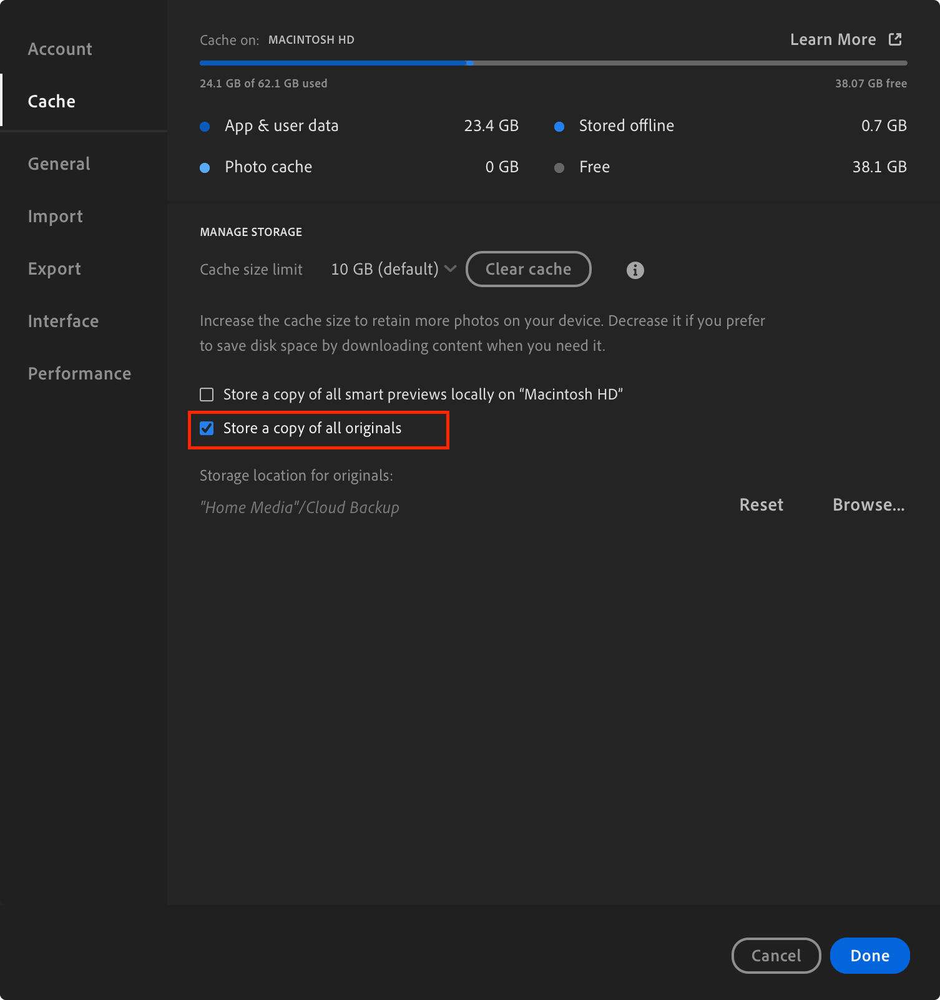

# Lightroom CC Backup

## What is it?

Unlike Lightroom Classic, Lightroom CC stores all of your photos and metadata in Adobe’s cloud. Lightroom CC offers an option to keep a local copy of your original photos (see below), but this only includes the image files - not your organisational data.

If you ever lost access to your Adobe account or Lightroom CC cloud storage, you would lose album structures, flags, and other information.

This script provides a programmatic way to back up that organisational metadata, including:

- Album and folder membership
- Photo flags (picked, rejected, unflagged)

The goal is to make it possible to reconstruct your Lightroom CC album structure if needed using only your local photo copies and this metadata backup.

## Motivation

I'm an avid photographer, though very much an enthusiast. Back in 2015, I was using the free Google Picasa to organise all my photos when it was discontinued. Google provided a migration path to Google Photos, but at the time I didn’t want to store my entire library in the cloud. Even though Picasa was no longer being updated, I was happy with its feature set and stability, so I kept using it (big mistake). Over time, more and more functionality began to break until it eventually became unusable.

In 2018 I had to find an alternative and moved to Lightroom CC. Much to my dismay, there was no way to migrate my existing library, and I ended up spending five years reorganising and editing everything from scratch.

This tool is an attempt to avoid that kind of lock-in with Lightroom CC should I ever wish to move to another platform (although, seven years later, I'm still quite happy with it).

## Limitations

- Performs full backups only — incremental backups are not yet supported
- Backs up album membership and flag status only (not full Lightroom CC metadata)
- Does not back up edits
- No restore functionality at this stage

## TODO

- Add support for incremental backups
- Improve performance for large libraries
- Backup additional metadata
- (Maybe) Explore “Lightroom-Backup-as-a-Service” hosting option
- (Maybe) Build a restore tool targeting an open-source DAM as a local Lightroom CC mirror

## Testing

This script has not been thoroughly tested. It has been run successfully on my Lightroom CC library of ~175k photos (execution time ≈ 2 hours).

All API interactions are read-only ([`GET` requests only](https://github.com/michaelmolino/lightroom-backup/blob/master/src/app.py#L127)), so it _should not_ modify or corrupt your Lightroom data. (The only exception is one [`POST` request](https://github.com/michaelmolino/lightroom-backup/blob/master/src/app.py#L122) as part of the OAuth flow.)

That said, it’s provided as-is with no warranty. **Use at your own risk**.

## Known Issues

- Photos that aren’t part of any album won’t appear in the final artifact.
- If an asset is reported as skipped, it was probably a stack. The photos inside the stack are included, but the stack grouping itself is not preserved.
- Deleted photos are included in the backup, but they are not marked as deleted.
- The cached authentication token is only valid for 24 hours. If a backup starts near the end of that window, the token may expire mid-run and the script will fail.

## Setup & Run

This script does not backup photos; it is useless unless you have the following setting to keep a local copy of all photos:
<!-- markdownlint-disable MD033 -->


You'll also need to do the following:

- The script needs an API client ID and secret.
  - Sign up in the [Adobe Developer Console](https://developer.adobe.com/console) then create a project and add Oauth Web App credentials.
  - `REDIRECT URI` should be `https://localhost:8080/callback`
  - `REDIRECT URI PATTERN` should be `https://localhost:8080/*`
  - Then set the following environment variables `LIGHTROOM_CLIENT_ID` and `LIGHTROOM_CLIENT_SECRET`.
- Run
  - Locally: `pipenv install && pipenv run python src/app.py`
  - Docker:

```bash
docker build -t lightroom-backup .
docker run --rm -it \
  -p 8080:8080 \
  -v $(pwd)/certs:/app/certs \
  -v $(pwd)/backups:/app/backups \
  -e LIGHTROOM_CLIENT_ID \
  -e LIGHTROOM_CLIENT_SECRET \
  lightroom-backup
```

## Validation

The following command will give you the total number of assets. You can compare this to "All Photos" in Lightroom CC.

``` bash
jq '.photos | length' ./backups/lightroom_backup_<DATETIME>.json
```

For more detail, the following command will give you the total counts per Album.

``` bash
jq '.albums | to_entries[] | "\(.key): \(.value.asset_ids | length)"' -r ./backups/lightroom_backup_<DATETIME>.json |sort
```

## API Documentation

[https://developer.adobe.com/lightroom/lightroom-api-docs/api/](https://developer.adobe.com/lightroom/lightroom-api-docs/api/)
